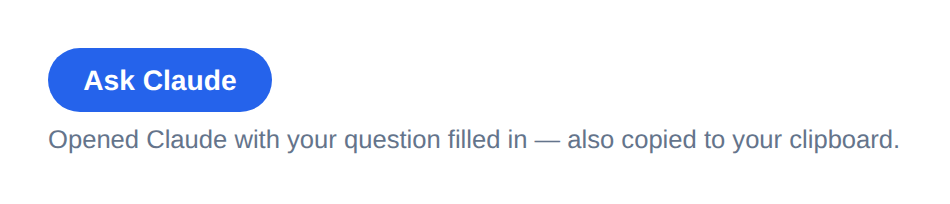

# @joka-7/modeldispatcher-react-ui

Two React components for the AI settings screen every one of your apps
needs and has been building separately — split along a line that matters:
**picking a preference is not the same thing as acting on it.**

- **`ModelPicker`** — a pure settings screen. Add one or more providers, a
  model picked from a curated list per provider, and one or more pooled
  API keys per provider — plus saving a favorite free AI app for later.
  Nothing in it ever navigates — clicking an option in Settings should
  never itself open a new tab.
- **`AskExternallyButton`** — the action that actually opens the saved
  favorite. It belongs wherever the user is composing a question (next to
  the prompt box), not on the settings screen — so clicking it is an
  expected "do something now" button, not a surprise redirect from a
  preferences page.

Built on top of [`@joka-7/modeldispatcher-browser-agent`](../browser-agent) —
these are purely the visual layer over that package's provider registry,
model shortlist, favorite-preference storage, and fallback dispatch, so the
two stay in lockstep.

**`ModelPicker`** — add providers, each with a model picked from a list and
one or more pooled keys, plus saving a favorite. Nothing below opens
anything:


**`AskExternallyButton`** — rendered separately, wherever a question is
actually being asked. This is the only thing that opens a tab:



## Why

StepByLearn, JobFlowTracker, KanDOne, and HighFive each ended up with their
own hand-built "AI settings" screen — same fields, different markup, subtly
different behaviour. `browser-agent` already fixed the *logic* duplication
(one provider registry, one `openExternalChat`). This package fixes the *UI*
duplication: one `<ModelPicker>` and one `<AskExternallyButton>`, so a new
app looks like the others from day one and a design change ships to every
app that imports it.

## Install

```bash
npm install @joka-7/modeldispatcher-react-ui
```

(Published to GitHub Packages, same as the other `@joka-7` client packages —
needs a `.npmrc` with `@joka-7:registry=https://npm.pkg.github.com` and a
`read:packages` token.)

## Usage

```tsx
import { useState } from "react";
import {
  loadConfig,
  saveConfig,
  loadExternalChatFavorite,
  saveExternalChatFavorite,
  complete,
} from "@joka-7/modeldispatcher-browser-agent";
import { ModelPicker, AskExternallyButton } from "@joka-7/modeldispatcher-react-ui";
import "@joka-7/modeldispatcher-react-ui/styles.css";

// Settings screen — nothing here ever navigates. config.providers is a
// fallback LIST: add Gemini, Groq, Anthropic, whatever, each with its own
// pooled key(s) — complete()/streamChat() from browser-agent try them in
// order automatically.
function AiSettings() {
  const [config, setConfig] = useState(loadConfig);
  const [favorite, setFavorite] = useState(loadExternalChatFavorite);

  return (
    <ModelPicker
      config={config}
      onConfigChange={(next) => {
        setConfig(next);
        saveConfig(next);
      }}
      externalChatFavorite={favorite}
      onExternalChatFavoriteChange={(next) => {
        setFavorite(next);
        saveExternalChatFavorite(next);
      }}
    />
  );
}

// Wherever the user actually composes a question — a chat box, a prompt
// field, wherever. This is the one place that opens anything.
function PromptBar({ question }: { question: string }) {
  const [favorite] = useState(loadExternalChatFavorite);
  return (
    <div>
      {/* ...your textarea/send button... */}
      <AskExternallyButton favorite={favorite} question={question} />
    </div>
  );
}

// Actually dispatching a request elsewhere in the app — no picker UI
// involved, just the config it produced:
async function ask(question: string) {
  return complete(loadConfig(), question); // tries every configured provider/key in order
}
```

Both components are controlled and stateless about persistence, the same
way `templates/vercel-app`'s `KeyWizard` is: they render props and call
callbacks with the full next value; wiring to `localStorage` (via
`loadConfig`/`saveConfig`/`loadExternalChatFavorite`/`saveExternalChatFavorite`)
or your own store happens at the call site.

### `ModelPicker` props

| Prop | Type | Required | Purpose |
| --- | --- | --- | --- |
| `config` | `AgentConfig` | yes | The active fallback list (`{ providers: ProviderCredential[], ollamaUrl }`) — see [`browser-agent`](../browser-agent) for the shape. |
| `onConfigChange` | `(config: AgentConfig) => void` | yes | Called with the full updated config on any add/remove/edit. |
| `externalChatFavorite` | `ExternalChatProviderId \| null` | yes | The saved "ask externally" favorite, or `null`. |
| `onExternalChatFavoriteChange` | `(favorite: ExternalChatProviderId \| null) => void` | yes | Called when the user picks or clears a favorite. Persist it yourself — this only reports the choice. |
| `glossaryUrl` | `string` | no | Where "New to AI agents?" links. Defaults to this repo's [`docs/GLOSSARY.md`](../../docs/GLOSSARY.md). |

Each provider card lets the user pick a model from `MODEL_OPTIONS` (a
curated shortlist per vendor, from `browser-agent`), add/remove pooled API
keys (or a single URL field for Ollama, which needs none), and remove the
whole provider. An "Add provider" row below the cards offers only the
vendors not already configured.

### `AskExternallyButton` props

| Prop | Type | Required | Purpose |
| --- | --- | --- | --- |
| `favorite` | `ExternalChatProviderId \| null` | yes | The saved favorite. Renders nothing when `null` — there's nothing to ask. |
| `question` | `string` | no | Current prompt, carried into the opened product. |
| `onExternalChat` | `(result: OpenExternalChatResult) => void` | no | Called after a click opens a tab — e.g. to show your own toast. |
| `externalChatDeps` | `OpenExternalChatDeps` | no | Injected `window.open`/clipboard, for tests or a non-browser host. |

## What's in scope, what isn't

This package owns rendering and layout only. It has no opinion on state
management, persistence, or theming beyond the optional default stylesheet
(`md-*` class names, safe to override or ignore entirely). It does not know
about any app's prompts or business logic — same boundary `browser-agent`
already draws. It also enforces one rule at the component boundary:
`ModelPicker` has no way to call `openExternalChat` even internally — that
action only exists in `AskExternallyButton`, so it can't accidentally end up
back on a settings screen.

## Testing

```bash
npm run typecheck
npm test
```

Tests render with `react-dom/client` directly against `jsdom` (no
`@testing-library` dependency) and mock `openExternalChat`'s `window.open`/
clipboard the same way `browser-agent`'s own tests do — no real network, no
real API key needed.
