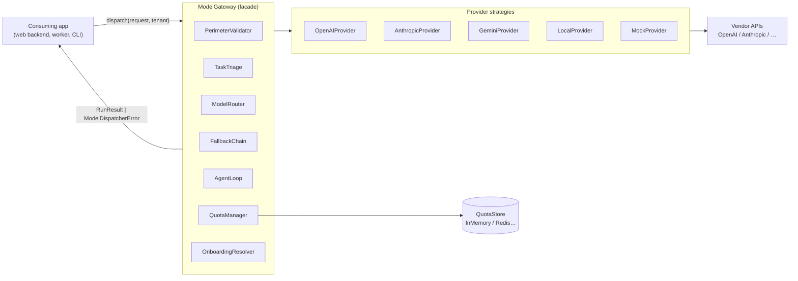
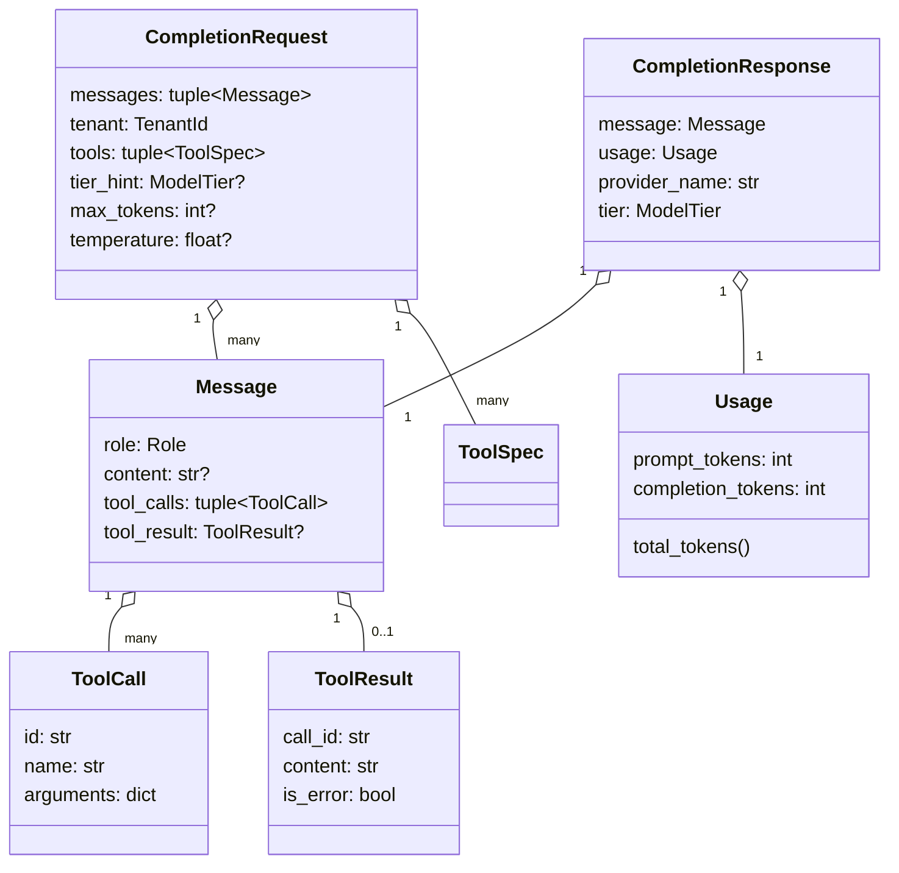
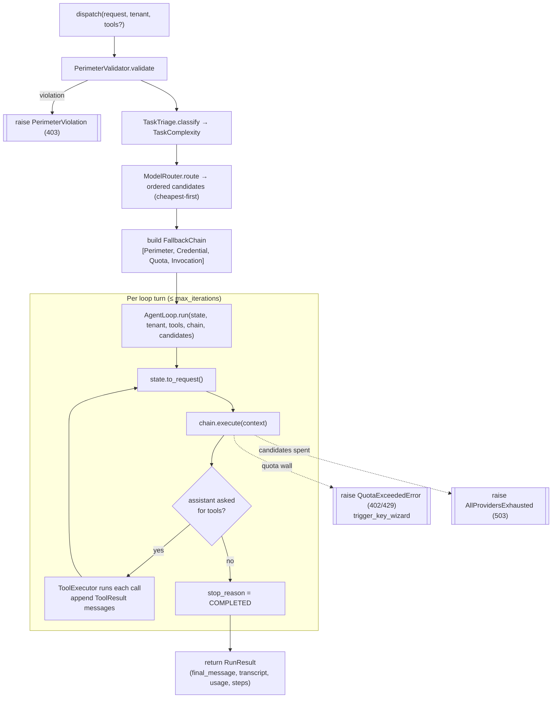
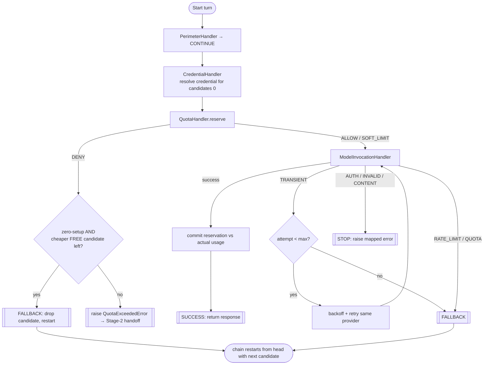

# ModelDispatcher — High-Level Design (HLD)

> **Scope:** the Phase-1 Python library under `src/model_dispatcher/`. The
> client/edge integration layer (TypeScript client + Vercel template) is designed
> separately in [`ARCHITECTURE_PHASE2.md`](../../ARCHITECTURE_PHASE2.md) and summarised
> at the end of this document.
>
> **Status:** architectural skeleton. Signatures, types, and docstrings are complete
> and pass `mypy --strict`; several method bodies are placeholders. This HLD describes
> the *intended* behaviour encoded by those signatures and docstrings.

---

## 1. Purpose

`ModelDispatcher` is a reusable internal library that acts as a central **AI Model
Gateway/Router**. A consuming application builds **one** `ModelGateway` at startup and
sends every LLM/agent request through it. The gateway then, transparently:

- picks a **cost-appropriate** model for the task,
- **fails over** to another provider on rate limits / exhaustion,
- runs a native **tool-calling loop**,
- enforces **per-tenant token quotas**,
- validates a **security perimeter**, and
- drives a two-stage **onboarding** flow (zero-setup → guided key handoff).

The design goal is that application code never imports a vendor SDK, never writes retry
loops, and never hand-rolls quota logic — it just calls `gateway.dispatch(request, tenant)`.

---

## 2. Problem statement

Modern apps that call LLMs repeatedly re-solve the same cross-cutting problems:

| Problem | Naive approach | Cost |
| --- | --- | --- |
| Which model to use? | Hard-code one model | Overpay for trivial tasks; underpower hard ones |
| Provider is rate-limited | try/except at each call site | Tangled, inconsistent, brittle |
| Multi-step tool use | Pull in a heavy agent framework | Opaque control flow, hard to test |
| Per-tenant fairness/cost | Ad-hoc counters | Drift, races, no soft warnings |
| Untrusted input at the edge | Scattered checks | Inconsistent, easy to bypass |
| New users need an API key | Block on signup | Friction; users churn before first value |

ModelDispatcher consolidates all of these behind a single facade with one entry point,
so each concern is solved once, in one place, and reused by every caller.

---

## 3. Design pillars

Each concern maps to a well-known pattern and a dedicated subpackage:

| Concern | Pattern | Where |
| --- | --- | --- |
| Pluggable model backends | **Strategy** | `providers/` (`ModelProvider`) |
| Rate-limit / exhaustion failover | **Chain of Responsibility** | `fallback/` |
| Agent tool-calling & state | **Native execution loop** | `orchestration/` |
| Cost control | **Triage → tiered routing** | `routing/` |
| Multi-tenant fairness | **Reserve/commit token quotas** | `quota/` |
| Untrusted-edge safety | **Perimeter + credential precedence** | `security/` |
| Onboarding | **Two-stage: zero-setup → GUI handoff** | `onboarding/` |
| One entry point | **Facade** | `gateway.py` (`ModelGateway`) |
| Uniform errors | **HTTP-aware exception hierarchy** | `exceptions.py` |

---

## 4. System context

The library is meant to sit *behind* an app's own HTTP edge and *in front of* the model
vendors. It owns orchestration; it delegates I/O to provider strategies and counting to a
pluggable store.



---

## 5. Domain vocabulary (data model)

All subsystems share one set of immutable value objects defined in `types.py`. Keeping
them behaviour-free prevents import cycles and lets every subsystem depend only on plain,
hashable data.



Key enumerations (all orderable where ordering matters):

| Enum | Meaning | Notable property |
| --- | --- | --- |
| `Role` | `system / user / assistant / tool` | mirrors chat-completion APIs |
| `ModelTier` | `FREE(0) < CHEAP(1) < STANDARD(2) < PREMIUM(3)` | `IntEnum` → cheapest-first sort |
| `TaskComplexity` | `TRIVIAL(0) … COMPLEX(3)` | `IntEnum` → maps monotonically to a tier floor |
| `ErrorClass` | `RATE_LIMIT / QUOTA / AUTH / TRANSIENT / INVALID / CONTENT` | normalised across vendors |
| `ProviderCapability` | `TOOLS / STREAMING / VISION / JSON_MODE` | `Flag` → bitwise capability filtering |

---

## 6. Logical components

| Component | Responsibility | Key type(s) |
| --- | --- | --- |
| **Facade** | Owns the *sequence* of steps, injects collaborators | `ModelGateway` |
| **Providers** | Vendor-agnostic model calls + error normalisation | `ModelProvider`, `ProviderRegistry` |
| **Routing** | Classify task cost, order candidate providers | `TaskTriage`, `ModelRouter` |
| **Fallback** | Transparent failover across candidates | `FallbackChain`, `FallbackHandler`s |
| **Orchestration** | Native tool-calling loop + run state | `AgentLoop`, `ConversationState`, `ToolExecutor` |
| **Quota** | Two-phase token accounting per tenant | `QuotaManager`, `QuotaStore` |
| **Security** | Perimeter + credential precedence + redaction | `PerimeterValidator`, `CredentialResolver`, `SecretRedactor` |
| **Onboarding** | Zero-setup vs guided key-wizard handoff | `OnboardingResolver`, `KeyWizardHandoff` |
| **Observability** | Redaction-aware logs + vendor-neutral metrics | `StructuredLogger`, `MetricsSink` |
| **Exceptions** | One HTTP-mappable error family | `ModelDispatcherError` + subclasses |

### 6.1 Providers — Strategy

`ModelProvider` is the single interface every backend implements: `complete`/`acomplete`,
`estimate_tokens`, and `classify_error`. The last one is the crucial seam — each adapter
maps its vendor SDK's exceptions onto the normalised `ErrorClass`, so nothing downstream
ever imports a vendor exception. Adapters import their SDKs lazily, keeping the core
dependency-free. `ProviderRegistry` indexes providers by name and tier and answers the
router's "cheapest capable" queries.

### 6.2 Routing — Triage then order

`TaskTriage.classify` assigns a `TaskComplexity` from cheap, deterministic signals (input
size, tool count, reasoning keywords, requested output size) — **no model call**.
`ModelRouter.route` maps that verdict onto a minimum `ModelTier` via `RoutingPolicy`,
filters by required capability (e.g. `TOOLS`), and returns an **ordered, cheapest-first
candidate list**. That list *is* the seed the fallback chain consumes — routing and
fallback ordering are one decision.

### 6.3 Fallback — Chain of Responsibility

An `InvocationContext` (request + mutable `candidates` list + attempt log) travels through
linked handlers, each returning a `HandlerOutcome`:

1. `PerimeterHandler` — security edge check.
2. `CredentialHandler` — resolve key via the precedence chain.
3. `QuotaHandler` — pre-flight `reserve()`; hard breach → handoff or fallback.
4. `ModelInvocationHandler` — call the current candidate; folds in bounded transient
   retry *and* rate-limit failover.

`FallbackChain.execute` interprets outcomes: `CONTINUE` advances, `SUCCESS` returns,
`FALLBACK` pops the current candidate and restarts from the head, `STOP` raises. When
candidates are spent it raises `AllProvidersExhausted` (503).

### 6.4 Orchestration — Native agent loop

`AgentLoop.run`/`arun` is a deliberate replacement for a heavy agent framework: a small,
explicit loop over `ConversationState`. Each turn snapshots state into a
`CompletionRequest`, dispatches it **through the fallback chain**, appends the assistant
message and usage, and — if the model asked for tools — runs them via `ToolExecutor` and
iterates; otherwise it returns a `RunResult`. Because every turn goes through the same
chain, fallback, quota, and security apply uniformly. Guards: `max_iterations` and an
optional `deadline`.

### 6.5 Quota — Two-phase, token-aware

- `reserve(tenant, estimate, provider)` → `QuotaDecision` (`ALLOW / SOFT_LIMIT / DENY`)
  checked against the tenant's windows (requests/min, tokens/min, tokens/day) and
  pre-charged so concurrent in-flight requests see each other.
- `commit(tenant, decision, actual_usage)` reconciles the estimate against the
  provider-reported usage so counters don't drift.

Counters live behind the `QuotaStore` **Protocol**; this build ships only
`InMemoryQuotaStore`, but a distributed backend can be dropped in without touching callers.

### 6.6 Security — Perimeter + credentials

`PerimeterValidator.validate` is the single choke point for untrusted inbound requests:
tenant authN, empty-message rejection, payload-size caps, and egress allowlist —
failing fast with `PerimeterViolation` (403). `CredentialResolver.resolve_candidates`
implements the precedence chain **user key(s) → tenant key(s) → free tier → global app
key**, which is the mechanical basis of onboarding Stage 1. A tenant may pool several
keys per provider (comma-separated); `ModelInvocationHandler` rotates through all of
them on failure before falling back to the next provider candidate. `SecretRedactor`
scrubs secrets/PII from anything bound for logs or metrics.

### 6.7 Onboarding — Two-stage flow

- **Stage 1 (zero-setup):** a brand-new tenant has no key, so `CredentialResolver`
  silently uses the rate-limited global app key / free tier. Stage is `ZERO_SETUP`.
- **Stage 2 (guided handoff):** once that shared capacity is spent, `KeyWizardHandoff.build`
  produces a `HandoffResponse` wrapped in `QuotaExceededError`. Its `to_payload()` is the
  exact front-end contract:

  ```json
  {"error": "quota_exceeded", "provider": "openai", "action": "trigger_key_wizard"}
  ```

  with `http_status` `402` (budget/upgrade wall) or `429` (rolling rate window).

---

## 7. Error model

Every error subclasses `ModelDispatcherError` and carries `http_status` + `to_payload()`,
so a web layer maps any failure to a response in a single `except`.

```
ModelDispatcherError            (500)
├── PerimeterViolation          (403)
├── AuthenticationError         (401)
├── RateLimitError              (429)   # internal fallback signal
├── QuotaExceededError          (402/429, carries the key-wizard handoff)
├── AllProvidersExhausted       (503)
└── ToolExecutionError          (500)
```

---

## 8. End-to-end dispatch flow



### 8.1 Inside one `chain.execute` turn



The decision of *what a failure means* is centralised in `fallback/conditions.py`:

| `ErrorClass` | `is_retryable` | `is_fallback_worthy` | `is_terminal` | Effect |
| --- | :---: | :---: | :---: | --- |
| `TRANSIENT` | ✅ | — | — | retry same provider (bounded), then fall back |
| `RATE_LIMIT` | — | ✅ | — | fall back to next candidate |
| `QUOTA` | — | ✅ | — | fall back to next candidate |
| `AUTH` | — | — | ✅ | `STOP` → `AuthenticationError` (401) |
| `INVALID` | — | — | ✅ | `STOP` → 502 provider error |
| `CONTENT` | — | — | ✅ | `STOP` → 502 provider error |

---

## 9. Concurrency model

Both sync and async APIs are first-class. The async path (`adispatch`, `acomplete`,
`ahandle`, `arun`, `aexecute`) is the native core; the sync helpers delegate through
`_async_bridge.run_sync`, which uses `asyncio.run` when no loop is active and a
worker-thread loop when one already is (avoiding re-entrancy deadlocks). Value objects are
immutable frozen dataclasses, so requests can be shared across the loop without defensive
copying.

---

## 10. Cross-cutting concerns

- **Observability:** `StructuredLogger` routes every field through `SecretRedactor` before
  emission; `MetricsSink` is a `Protocol` so apps plug in any backend (counters for
  dispatch latency, fallback depth, tokens/tenant, quota denials).
- **Security-by-default:** perimeter runs first *and* is re-checked inside the chain;
  secrets are masked at resolution (`_mask`) and redacted at emission.
- **Determinism for tests:** `MockProvider` implements the full strategy with scripted
  replies and failure injection, so routing/fallback/quota/loop are testable with no I/O.

---

## 11. Quality & non-functional requirements

| Attribute | Approach |
| --- | --- |
| **Type safety** | `mypy --strict`; PEP 695 generics/aliases; no `Any` |
| **Style** | `ruff` (E, W, F, I, N, UP, B, D) + `ruff format` |
| **Testability** | Constructor injection everywhere; `MockProvider`; contract tests in `tests/` |
| **Extensibility** | New provider = implement + register; new store/metrics = implement a Protocol |
| **Cost efficiency** | Cheapest-capable-first routing; free-tier preference for zero-setup |
| **Resilience** | Bounded retry + multi-provider failover + deadline/iteration guards |
| **Multi-tenancy** | Per-tenant windows, soft limits, reserve/commit accuracy |

---

## 12. Extension points

- **New provider:** implement `ModelProvider`, register it — no other change.
- **Custom triage:** pass a `ComplexityScorer` callable to `TaskTriage`.
- **Distributed quotas:** implement the `QuotaStore` Protocol.
- **New fallback behaviour:** add a `FallbackHandler` and place it in the chain.
- **Metrics backend:** implement the `MetricsSink` Protocol.
- **Routing policy tuning:** adjust `RoutingPolicy` (floors, escalation, `max_candidates`)
  — no code change.

---

## 13. Phase 2 — client & edge integration (summary)

Phase 2 (see [`ARCHITECTURE_PHASE2.md`](../../ARCHITECTURE_PHASE2.md)) packages the library
for any Next.js/React app on Vercel:

- a thin `api/gateway.py` **Adapter** (with a Firebase **App Check** guard clause) that
  maps `ModelDispatcherError → JSONResponse(exc.http_status, exc.to_payload())`;
- a typed TypeScript **interceptor client** (timeout, retry-with-jitter for 5xx, App Check
  header, and a handoff decoder that turns a 402/429 `trigger_key_wizard` body into typed
  state and an event-bus signal);
- a `useGateway` React hook that opens the `<KeyWizard/>` on the handoff event.

The library returns the structured object; the web app maps it to HTTP and launches the
key wizard. See the LLD for detailed class/method contracts of the Phase-1 core.

---

## 14. Summary

ModelDispatcher is a **facade over a pipeline**: validate → triage → route → (chain:
perimeter → credential → quota → invoke) → agent loop → commit. Each stage is an
injected, single-responsibility collaborator behind a small interface, and the whole thing
is expressed once so every caller inherits cost-aware routing, transparent failover,
token-accurate multi-tenant quotas, a native tool loop, and a structured onboarding handoff
— without ever touching a vendor SDK or writing a retry loop.
