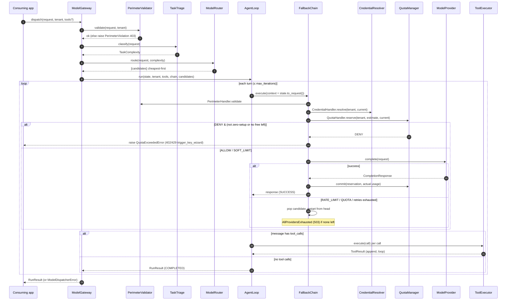

# ModelDispatcher — Low-Level Design (LLD)

> Companion to [`docs/hld/hld.md`](../hld/hld.md). The HLD explains *what* the system does
> and *why*; this LLD explains *how* — the concrete classes, method signatures, data
> types, and decision logic in `src/model_dispatcher/`.
>
> **Status:** architectural skeleton — signatures and docstrings are complete and pass
> `mypy --strict`; some method bodies are placeholders. All signatures below match the
> current source.

---

## 1. Directory structure

```
src/model_dispatcher/
├── __init__.py          # public API surface (facade + value types + exceptions)
├── gateway.py           # ModelGateway — the Facade
├── config.py            # GatewaySettings, RoutingPolicy, SecuritySettings, QuotaDefaults
├── types.py             # value objects, enums, JSON/TenantId aliases (behaviour-free)
├── exceptions.py        # ModelDispatcherError hierarchy (http_status + to_payload)
├── _async_bridge.py     # run_sync(): drive the async core from sync callers
├── providers/           # STRATEGY
│   ├── base.py          #   ModelProvider (ABC)
│   ├── registry.py      #   ProviderRegistry
│   ├── mock_provider.py #   MockProvider (tests/demo)
│   └── {openai,anthropic,gemini,local}_provider.py
├── routing/
│   ├── triage.py        #   TaskTriage + ComplexityScorer
│   └── router.py        #   ModelRouter
├── fallback/            # CHAIN OF RESPONSIBILITY
│   ├── handlers.py      #   HandlerOutcome, InvocationContext, handlers
│   ├── chain.py         #   FallbackChain (executor)
│   └── conditions.py    #   is_retryable / is_fallback_worthy / is_terminal
├── orchestration/       # NATIVE LOOP
│   ├── loop.py          #   AgentLoop
│   ├── state.py         #   ConversationState
│   ├── tools.py         #   Tool, ToolRegistry, ToolExecutor
│   └── result.py        #   RunResult, StepResult, StopReason
├── quota/
│   ├── manager.py       #   QuotaManager, QuotaDecision, QuotaOutcome
│   ├── tenant.py        #   TenantContext, TenantQuota, QuotaWindow
│   ├── store.py         #   QuotaStore (Protocol), InMemoryQuotaStore
│   └── tokenizer.py     #   TokenCounter
├── security/
│   ├── perimeter.py     #   PerimeterValidator
│   ├── credentials.py   #   CredentialResolver, Credential, CredentialSource
│   └── redaction.py     #   SecretRedactor
├── onboarding/
│   ├── flow.py          #   OnboardingResolver, OnboardingStage
│   └── handoff.py       #   KeyWizardHandoff, HandoffResponse, HandoffAction
└── observability/
    ├── logging.py       #   StructuredLogger
    └── metrics.py       #   MetricsSink (Protocol), NullMetricsSink
```

---

## 2. Core types (`types.py`)

Behaviour-free, immutable (`@dataclass(frozen=True, slots=True)`) value objects shared by
every subsystem. This module is the single source of truth and imports nothing from the
package, which is what breaks potential import cycles.

### 2.1 Aliases & enums

```python
TenantId = NewType("TenantId", str)
type JSONValue = None | bool | int | float | str | list[JSONValue] | dict[str, JSONValue]

class Role(StrEnum):              SYSTEM, USER, ASSISTANT, TOOL
class ModelTier(IntEnum):         FREE=0, CHEAP=1, STANDARD=2, PREMIUM=3
class TaskComplexity(IntEnum):    TRIVIAL=0, SIMPLE=1, MODERATE=2, COMPLEX=3
class ErrorClass(StrEnum):        RATE_LIMIT, QUOTA, AUTH, TRANSIENT, INVALID, CONTENT
class ProviderCapability(Flag):   NONE=0, TOOLS, STREAMING, VISION, JSON_MODE
```

- `ModelTier`/`TaskComplexity` are `IntEnum` **on purpose**: routing compares with `>=` and
  sorts candidates ascending (cheapest-first).
- `ProviderCapability` is a `Flag` so requirements combine bitwise
  (`required & provider.capabilities == required`).

### 2.2 Value objects

| Type | Fields | Notes |
| --- | --- | --- |
| `Usage` | `prompt_tokens`, `completion_tokens` | `total_tokens` property; `__add__` folds multi-step totals |
| `ToolSpec` | `name`, `description`, `parameters: dict` | `parameters` is JSON Schema |
| `ToolCall` | `id`, `name`, `arguments: dict` | decoded from a completion |
| `ToolResult` | `call_id`, `content`, `is_error=False` | fed back to the model |
| `Message` | `role`, `content?`, `tool_calls=()`, `tool_result?` | carries at most one of calls/result |
| `CompletionRequest` | `messages`, `tenant`, `tools=()`, `tier_hint?`, `max_tokens?`, `temperature?`, `metadata` | provider input |
| `CompletionResponse` | `message`, `usage`, `provider_name`, `tier`, `raw?` | provider output |

---

## 3. Configuration (`config.py`)

All frozen dataclasses; constructed once at startup and injected.

```python
@dataclass(frozen=True, slots=True)
class RoutingPolicy:
    complexity_floor: dict[TaskComplexity, ModelTier]  # default: TRIVIAL→FREE … COMPLEX→PREMIUM
    allow_escalation: bool = True     # keep higher tiers so fallback can climb
    max_candidates: int = 4           # cap on chain seed length

@dataclass(frozen=True, slots=True)
class SecuritySettings:
    max_payload_bytes: int = 1_000_000
    allowed_providers: frozenset[str] = frozenset()   # empty ⇒ all
    require_tenant_auth: bool = True

@dataclass(frozen=True, slots=True)
class QuotaDefaults:
    requests_per_min: int = 20
    tokens_per_min: int = 40_000
    tokens_per_day: int = 1_000_000
    budget_usd: float | None = None
    soft_limit_ratio: float = 0.9

@dataclass(frozen=True, slots=True)
class GatewaySettings:
    routing: RoutingPolicy
    security: SecuritySettings
    quota_defaults: QuotaDefaults
    global_app_tenant: str = "__global_app__"
    max_iterations: int = 8
    retry_max_attempts: int = 3
```

---

## 4. Facade (`gateway.py`)

`ModelGateway` is a thin orchestrator — it owns the *sequence* of steps, not their
implementations. Collaborators are injected via the constructor; `create()` wires the
common defaults.

```python
class ModelGateway:
    def __init__(self, settings, *, providers, perimeter, credentials, triage,
                 router, quota, onboarding, agent_loop) -> None: ...

    @classmethod
    def create(cls, providers: ProviderRegistry, *,
               settings: GatewaySettings | None = None,
               quota_store: QuotaStore | None = None,
               scorer: ComplexityScorer | None = None) -> ModelGateway: ...

    @property
    def providers(self) -> ProviderRegistry: ...

    def  dispatch(self, request, tenant, *, tools=None) -> RunResult: ...
    async def adispatch(self, request, tenant, *, tools=None) -> RunResult: ...
```

### 4.1 `create()` default wiring

| Collaborator | Default |
| --- | --- |
| `quota` | `QuotaManager(quota_store or InMemoryQuotaStore())` |
| `credentials` | `CredentialResolver()` |
| `perimeter` | `PerimeterValidator(settings.security, credentials)` |
| `triage` | `TaskTriage(scorer)` |
| `router` | `ModelRouter(providers, settings.routing)` |
| `onboarding` | `OnboardingResolver(KeyWizardHandoff())` |
| `agent_loop` | `AgentLoop(settings.max_iterations)` |

### 4.2 Private helpers

- `_prepare(request, tenant, tools) -> (ConversationState, ToolRegistry, list[ModelProvider])`
  runs perimeter → triage → route and builds the initial state. Tool source:

  ```161:168:src/model_dispatcher/gateway.py
        registry = tools or ToolRegistry()
        effective_tools = registry.specs() if tools is not None else request.tools
        state = ConversationState(
            tenant=tenant.tenant_id,
            messages=list(request.messages),
            tools=effective_tools,
        )
        return state, registry, candidates
  ```

- `_build_chain() -> FallbackChain` composes, in order:
  `PerimeterHandler → CredentialHandler → QuotaHandler → ModelInvocationHandler`
  (the invocation handler is constructed with `max_attempts=settings.retry_max_attempts`).

---

## 5. Providers (`providers/`)

### 5.1 `ModelProvider` (ABC) — the Strategy contract

```python
class ModelProvider(ABC):
    name: str
    tier: ModelTier
    capabilities: ProviderCapability

    @abstractmethod def  complete(self, request) -> CompletionResponse: ...
    @abstractmethod async def acomplete(self, request) -> CompletionResponse: ...
    @abstractmethod def  estimate_tokens(self, request) -> int: ...
    @abstractmethod def  classify_error(self, exc: Exception) -> ErrorClass: ...
```

- `classify_error` is the isolation seam: vendor exceptions never escape the adapter.
- Concrete adapters (`OpenAIProvider`, `AnthropicProvider`, `GeminiProvider`,
  `LocalProvider`) import their SDKs **lazily** inside method bodies.

### 5.2 `ProviderRegistry`

Name-keyed dict preserving insertion order (deterministic tie-breaking).

| Method | Returns | Purpose |
| --- | --- | --- |
| `register(provider)` | `None` | add/replace by `provider.name` |
| `get(name)` | `ModelProvider` | identity lookup (`KeyError` if absent) |
| `all()` | `list` | insertion order |
| `by_tier(tier)` | `list` | providers at exactly `tier` |
| `at_or_above(floor)` | `list` | tier `>= floor`, **stable-sorted cheapest-first** |
| `cheapest_capable(floor, required)` | `ModelProvider` | first at/above floor matching caps (`LookupError` if none) |

### 5.3 `MockProvider` (tests/demo)

Full strategy with no I/O. Supports **scripted replies** (`deque[Message]`, one per turn)
and **failure injection** (`fail_times` calls raise `MockError(fail_with)` before
succeeding). `classify_error` returns the injected class, else `TRANSIENT`.

---

## 6. Routing (`routing/`)

### 6.1 `TaskTriage`

```python
type ComplexityScorer = Callable[[CompletionRequest], TaskComplexity]

class TaskTriage:
    def __init__(self, scorer: ComplexityScorer | None = None) -> None: ...
    def classify(self, request) -> TaskComplexity: ...
```

Default heuristic `_default_scorer` accumulates a weighted score, then buckets it:

| Signal | Weight |
| --- | --- |
| text length | `min(len(text)/500, 4.0)` |
| declared tools | `+1.0` per tool |
| reasoning markers (`prove`, `step by step`, `analyze`, `design`, `refactor`, …) | `+1.0` each |
| fenced code block present in text | `+1.0` |
| `max_tokens > 1024` | `+1.0` |

Buckets: `<1.5 → TRIVIAL`, `<3.0 → SIMPLE`, `<5.0 → MODERATE`, else `COMPLEX`.

### 6.2 `ModelRouter`

```python
class ModelRouter:
    def __init__(self, registry: ProviderRegistry, policy: RoutingPolicy) -> None: ...
    def route(self, request, complexity) -> list[ModelProvider]: ...
```

Algorithm:

1. `floor = policy.complexity_floor[complexity]`; a `request.tier_hint` may **raise** the
   floor, never lower it.
2. `required = TOOLS if request.tools else NONE`.
3. `candidates = [p for p in registry.at_or_above(floor) if required & p.capabilities == required]`.
4. If `not policy.allow_escalation`: keep only `p.tier == floor`.
5. Return `candidates[: policy.max_candidates]` — the fallback chain's seed list.

---

## 7. Fallback (`fallback/`)

### 7.1 State objects (`handlers.py`)

```python
class HandlerOutcome(Enum): CONTINUE, SUCCESS, FALLBACK, STOP

@dataclass(slots=True)
class AttemptRecord:
    provider_name: str
    error_class: ErrorClass | None = None
    detail: str | None = None

@dataclass(slots=True)
class InvocationContext:
    request: CompletionRequest
    tenant: TenantContext
    candidates: list[ModelProvider]        # index 0 = "current"; consumed from front
    attempts: list[AttemptRecord] = []
    credential: Credential | None = None
    reservation: QuotaDecision | None = None
    response: CompletionResponse | None = None
    error: Exception | None = None
    warnings: list[str] = []

    @property def current(self) -> ModelProvider | None      # candidates[0] or None
    def reset_candidate_state(self) -> None                  # clears credential + reservation
```

### 7.2 Handlers

`FallbackHandler` is an ABC with `handle`/`ahandle` and `set_next`.

| Handler | `handle` behaviour | Outcomes |
| --- | --- | --- |
| `PerimeterHandler(validator)` | `validator.validate(request, tenant)` | `CONTINUE` (or raises) |
| `CredentialHandler(resolver)` | `context.credential = resolver.resolve(tenant, current)` | `CONTINUE`; `FALLBACK` if no current |
| `QuotaHandler(manager, onboarding)` | `estimate = current.estimate_tokens(request)`; `decision = manager.reserve(...)` | `CONTINUE` / `FALLBACK` / raises `QuotaExceededError` |
| `ModelInvocationHandler(manager, *, max_attempts, backoff_base=0.05, backoff_cap=2.0)` | call current; on success `commit`; on error classify | `SUCCESS` / `FALLBACK` / `STOP` |

**`QuotaHandler._on_deny`** — the onboarding branch point:

```223:243:src/model_dispatcher/fallback/handlers.py
    def _on_deny(
        self,
        context: InvocationContext,
        provider: ModelProvider,
        decision: QuotaDecision,
    ) -> HandlerOutcome:
        """Decide between staying zero-setup and raising the Stage-2 handoff."""
        cheaper_free_remaining = any(
            candidate.tier is ModelTier.FREE for candidate in context.candidates[1:]
        )
        if context.tenant.is_zero_setup and cheaper_free_remaining:
            return HandlerOutcome.FALLBACK

        rate_window = decision.breached_window in (
            "requests_per_min",
            "tokens_per_min",
        )
        handoff = self._onboarding.escalate(
            context.tenant, provider.name, rate_window=rate_window
        )
        raise QuotaExceededError(handoff)
```

**`ModelInvocationHandler`** folds retry + failover into one place because they wrap the
same network call. `_on_error` returns `None` to mean "retry after backoff", or a concrete
outcome:

```329:350:src/model_dispatcher/fallback/handlers.py
    def _on_error(
        self,
        context: InvocationContext,
        provider: ModelProvider,
        exc: Exception,
        attempt: int,
    ) -> HandlerOutcome | None:
        """Classify an error and decide the next step.

        Returns ``None`` to signal "retry the same provider after backoff", or a
        concrete :class:`HandlerOutcome` (FALLBACK / STOP) to act on now.
        """
        error_class = provider.classify_error(exc)
        context.attempts.append(AttemptRecord(provider.name, error_class, str(exc)))

        if is_retryable(error_class) and attempt < self._max_attempts:
            return None
        if is_fallback_worthy(error_class) or is_retryable(error_class):
            return HandlerOutcome.FALLBACK

        context.error = self._terminal_error(provider.name, error_class, exc)
        return HandlerOutcome.STOP
```

- Backoff: `min(backoff_base * 2**(attempt-1), backoff_cap)` seconds.
- On success `_on_success` records the attempt, sets `context.response`, and, if a
  reservation exists, calls `manager.commit(tenant, reservation, response.usage)`.
- Terminal mapping: `AUTH → AuthenticationError (401)`; everything else terminal →
  `ModelDispatcherError` with `http_status = 502`, `error_code = f"provider_{class}"`.
- `RateLimitHandler` and `RetryHandler` exist as **optional standalone links** for
  alternative compositions; the default chain does not include them (their concerns live in
  `ModelInvocationHandler`).

### 7.3 `FallbackChain` (executor, `chain.py`)

```python
class FallbackChain:
    @classmethod def build(cls, handlers: Sequence[FallbackHandler]) -> FallbackChain
    def  execute(self, context) -> CompletionResponse
    async def aexecute(self, context) -> CompletionResponse
```

`execute` loops the handler list from the head and interprets each outcome:

- `CONTINUE` → next handler;
- `SUCCESS` → return `context.response`;
- `STOP` → raise `context.error` (or a generic error);
- `FALLBACK` → break inner loop, then `_advance_or_raise`: `candidates.pop(0)`,
  `reset_candidate_state()`, and either restart from the head or raise
  `AllProvidersExhausted` when the list is empty.
- Empty candidate list up front → `AllProvidersExhausted` immediately.

### 7.4 `conditions.py`

| Predicate | True for |
| --- | --- |
| `is_retryable` | `TRANSIENT` |
| `is_fallback_worthy` | `RATE_LIMIT`, `QUOTA` |
| `is_terminal` | `AUTH`, `INVALID`, `CONTENT` |

---

## 8. Orchestration (`orchestration/`)

### 8.1 `ConversationState` (`state.py`)

```python
@dataclass(slots=True)
class ConversationState:
    tenant: TenantId
    messages: list[Message]
    tools: tuple[ToolSpec, ...] = ()
    usage: Usage = Usage()
    iterations: int = 0

    def append(self, message) -> None
    def add_usage(self, usage) -> None
    def to_request(self) -> CompletionRequest   # snapshot: full transcript + tools
```

The loop is stateless; **all** mutable data lives here. `to_request()` is what each turn
feeds to the chain, so the model always sees the up-to-date transcript (including prior
tool results).

### 8.2 Tools (`tools.py`)

```python
type ToolHandler      = Callable[[dict[str, JSONValue]], str]
type AsyncToolHandler = Callable[[dict[str, JSONValue]], Awaitable[str]]

@dataclass(frozen=True, slots=True)
class Tool:
    spec: ToolSpec
    handler:  ToolHandler | None = None
    ahandler: AsyncToolHandler | None = None

class ToolRegistry:                      # name-indexed
    def register(self, tool) -> None
    def specs(self) -> tuple[ToolSpec, ...]
    def get(self, name) -> Tool
    def __contains__(self, name) -> bool

class ToolExecutor:
    def  execute(self, call: ToolCall) -> ToolResult
    async def aexecute(self, call: ToolCall) -> ToolResult
```

`ToolExecutor` never lets a tool crash the run: unknown tool, missing handler, or a raised
exception all become a `ToolResult(is_error=True)` fed back to the model.

### 8.3 `AgentLoop` (`loop.py`)

```python
class AgentLoop:
    def __init__(self, max_iterations: int) -> None
    def  run(self, state, tenant, tools, chain, candidates, *, deadline=None) -> RunResult
    async def arun(self, state, tenant, tools, chain, candidates, *, deadline=None) -> RunResult
```

Per iteration (≤ `max_iterations`):

1. If `deadline` passed → finalize with `StopReason.DEADLINE`.
2. Build `InvocationContext(request=state.to_request(), tenant, candidates=list(candidates))`
   — a **fresh candidate copy per turn**.
3. `chain.execute(context)` → response.
4. `_absorb_response`: `state.append(message)`, `state.add_usage`, `state.iterations += 1`,
   append a `StepResult(message, usage, attempts)`.
5. If `message.tool_calls`: run each via `ToolExecutor`, append `Message(role=TOOL,
   tool_result=…)`, continue; else finalize with `StopReason.COMPLETED`.
6. Cap hit → `StopReason.MAX_ITERATIONS`.

`_finalize` picks the last `ASSISTANT` message as `final_message` and assembles the
`RunResult`.

### 8.4 Results (`result.py`)

```python
class StopReason(StrEnum): COMPLETED, MAX_ITERATIONS, DEADLINE, ERROR

@dataclass(frozen=True, slots=True)
class StepResult:  message: Message; usage: Usage; attempts: tuple[AttemptRecord, ...] = ()

@dataclass(frozen=True, slots=True)
class RunResult:
    final_message: Message
    transcript: tuple[Message, ...]
    usage: Usage
    stop_reason: StopReason
    steps: tuple[StepResult, ...] = ()
```

---

## 9. Quota (`quota/`)

### 9.1 Tenancy (`tenant.py`)

```python
@dataclass(frozen=True, slots=True)
class TenantQuota:
    requests_per_min: int
    tokens_per_min: int
    tokens_per_day: int
    budget_usd: float | None = None
    soft_limit_ratio: float = 0.9

@dataclass(frozen=True, slots=True)
class TenantContext:
    tenant_id: TenantId
    quota: TenantQuota
    is_zero_setup: bool = True            # riding shared/free capacity ⇒ Stage 1
    max_tier: ModelTier = ModelTier.PREMIUM
    metadata: dict[str, str] = {}         # holds user_key:*/tenant_key:* + forced_provider
```

### 9.2 Store (`store.py`)

```python
type WindowKey = str
WINDOW_SECONDS = {"requests_per_min": 60, "tokens_per_min": 60, "tokens_per_day": 86_400}

@runtime_checkable
class QuotaStore(Protocol):
    def read(self, tenant, window) -> int
    def incr(self, tenant, window, tokens) -> int      # atomic; returns new total
    def reset_expired(self) -> None

class InMemoryQuotaStore:                               # dict[(tenant, window)] = (count, period)
    # Fixed tumbling windows: period = floor(monotonic() / duration); bucket
    # auto-resets when the period index changes. Single-process only.
```

### 9.3 Manager (`manager.py`)

```python
class QuotaOutcome(StrEnum): ALLOW, SOFT_LIMIT, DENY

@dataclass(frozen=True, slots=True)
class QuotaDecision:
    outcome: QuotaOutcome
    reserved_tokens: int
    breached_window: str | None = None
    provider_name: str | None = None

class QuotaManager:
    def __init__(self, store: QuotaStore) -> None
    def reserve(self, tenant, estimated_tokens, provider) -> QuotaDecision
    def commit(self, tenant, decision, actual: Usage) -> None
```

**`reserve`** checks three windows (`requests_per_min +1`, `tokens_per_min +estimate`,
`tokens_per_day +estimate`). Any `prospective > cap` → immediate `DENY` (no counters
incremented). Otherwise, crossing `cap * soft_limit_ratio` on any window → `SOFT_LIMIT`;
else `ALLOW`. On a non-deny verdict it increments all three counters so concurrent requests
see the reservation.

**`commit`** reconciles: `delta = actual.total_tokens - decision.reserved_tokens`; if
non-zero, applies `delta` to `tokens_per_min` and `tokens_per_day` (a negative delta
refunds an over-estimate). Request count is not re-adjusted.

### 9.4 `TokenCounter` (`tokenizer.py`)

Provider-agnostic pre-flight estimate: sum of message content chars + tool-call chars +
tool-result chars + tool-schema chars, divided by `chars_per_token` (default 4.0), plus
`4 * len(messages)` envelope overhead, `math.ceil`-rounded. Intentionally conservative
(rounds up) so reservations never under-count. (Providers may override with an exact
tokenizer via `estimate_tokens`.)

---

## 10. Security (`security/`)

### 10.1 `PerimeterValidator` (`perimeter.py`)

```python
class PerimeterValidator:
    def __init__(self, settings: SecuritySettings, credentials: CredentialResolver) -> None
    def validate(self, request: CompletionRequest, tenant: TenantContext) -> None
```

Fail-fast order, raising `PerimeterViolation` (403):

1. `require_tenant_auth` and empty `tenant.tenant_id` → reject.
2. Empty `request.messages` → reject.
3. `_estimate_payload_bytes(request) > max_payload_bytes` → reject.
4. Non-empty `allowed_providers` and `tenant.metadata["forced_provider"]` outside it → reject.

### 10.2 `CredentialResolver` (`credentials.py`)

```python
class CredentialSource(StrEnum): USER, TENANT, GLOBAL_APP, FREE_TIER

@dataclass(frozen=True, slots=True)
class Credential:
    provider_name: str
    source: CredentialSource
    secret_ref: str                          # masked; safe to log
    raw_key: str | None = field(repr=False)   # actual secret; never in repr()
    is_rate_limited: bool = False             # True for the shared global key

class CredentialResolver:
    def resolve(self, tenant, provider) -> Credential
        # = resolve_candidates(tenant, provider)[0]
    def resolve_candidates(self, tenant, provider) -> list[Credential]
```

Precedence (first *match* wins — the whole match, not one key at a time), keyed by
provider **family** = `provider.name.split(":")[0]`:

1. `metadata["user_key:<family>"]` → one `Credential` per comma-separated key, source
   `USER`, in list order. A single key with no comma is a one-element list — existing
   single-key tenants are unaffected.
2. `metadata["tenant_key:<family>"]` → same splitting, source `TENANT`.
3. `provider.tier is FREE` → one keyless `FREE_TIER` credential.
4. `tenant.is_zero_setup` → one `GLOBAL_APP` credential (`is_rate_limited=True`) —
   basis of Stage 1.
5. Otherwise → raise `AuthenticationError` (401).

`ModelInvocationHandler` consumes the full candidate list: it tries each credential's
`raw_key` in order (passed as `ModelProvider.complete(request, api_key=...)`), retrying
transient failures on the *same* key, moving to the *next pooled key* on rate-limit/
quota/auth, and only returning `FALLBACK` to the next provider candidate once every
pooled key is exhausted.

`_mask(secret)` returns `"****" + secret[-4:]` (or `"****"` for short strings).

### 10.3 `SecretRedactor` (`redaction.py`)

Recursively walks a `JSONValue`; redacts values whose **key** matches a sensitive-name
regex (`api_key`, `authorization`, `secret`, `token`, `password`, `bearer`, …) or whose
**value** matches a secret-shaped regex (`sk-…`, `Bearer …`, long high-entropy blobs) with
`"[REDACTED]"`, preserving structure. `scrub_text` handles inline substrings.

---

## 11. Onboarding (`onboarding/`)

### 11.1 `HandoffResponse` / `KeyWizardHandoff` (`handoff.py`)

```python
class HandoffAction(StrEnum): TRIGGER_KEY_WIZARD, UPGRADE_PLAN, RETRY_LATER

@dataclass(frozen=True, slots=True)
class HandoffResponse:
    error: str
    provider: str
    action: HandoffAction
    http_status: int              # 402 budget wall | 429 rolling window
    detail: str | None = None
    def to_payload(self) -> dict[str, JSONValue]   # {"error","provider","action"[, "detail"]}

class KeyWizardHandoff:
    def build(self, provider, *, reason="quota_exceeded",
              rate_window=False, detail=None) -> HandoffResponse
    # http_status = 429 if rate_window else 402
```

### 11.2 `OnboardingResolver` (`flow.py`)

```python
class OnboardingStage(StrEnum): ZERO_SETUP, GUIDED_HANDOFF

class OnboardingResolver:
    def __init__(self, handoff_factory: KeyWizardHandoff) -> None
    def stage(self, tenant) -> OnboardingStage        # zero_setup iff tenant.is_zero_setup
    def escalate(self, tenant, provider, *, rate_window: bool) -> HandoffResponse
```

`escalate` chooses the human-readable `detail` based on `is_zero_setup`, then delegates to
`KeyWizardHandoff.build`. The caller (`QuotaHandler`) wraps the result in
`QuotaExceededError`, whose `http_status`/`to_payload()` come straight from the handoff.

---

## 12. Exceptions (`exceptions.py`)

```python
class ModelDispatcherError(Exception):
    http_status: int = 500
    error_code: str = "internal_error"
    def __init__(self, message: str) -> None
    def to_payload(self) -> dict[str, JSONValue]   # {"error": error_code, "detail": message}
```

| Subclass | `http_status` | `error_code` | Notes |
| --- | --- | --- | --- |
| `PerimeterViolation` | 403 | `perimeter_violation` | edge rejection |
| `AuthenticationError` | 401 | `authentication_error` | no resolvable credential |
| `RateLimitError` | 429 | `rate_limited` | internal fallback signal |
| `QuotaExceededError` | 402/429 | `quota_exceeded` | wraps `HandoffResponse`; `to_payload` = handoff payload |
| `AllProvidersExhausted` | 503 | `all_providers_exhausted` | candidates spent |
| `ToolExecutionError` | 500 | `tool_execution_error` | carries `tool_name` |

---

## 13. Concurrency bridge (`_async_bridge.py`)

```python
def run_sync[T](coro: Coroutine[object, object, T]) -> T
```

If no event loop runs in the current thread → `asyncio.run(coro)`. If a loop is already
running → run the coroutine on a dedicated worker thread with its own loop (avoids
re-entrancy deadlocks), then re-raise any exception on the caller's thread. This is how the
sync API can be layered on the async core without duplicating pipeline logic.

---

## 14. Observability (`observability/`)

```python
class StructuredLogger:
    def __init__(self, name: str, redactor: SecretRedactor | None = None) -> None
    def event(self, name: str, **fields: JSONValue) -> None   # scrubs fields, logs.info

@runtime_checkable
class MetricsSink(Protocol):
    def increment(self, name: str, value: int = 1, **tags: str) -> None
    def observe(self, name: str, value: float, **tags: str) -> None

class NullMetricsSink:  # no-op default
```

---

## 15. End-to-end data flow



---

## 16. Design decisions & alternatives considered

### Retry vs fallback placement
- **Chosen:** fold transient retry *and* rate-limit failover into `ModelInvocationHandler`,
  since both wrap the same network call; keep `RateLimitHandler`/`RetryHandler` as optional
  standalone links. **Pro:** one place owns the call lifecycle; fewer chain hops.
  **Con:** the invocation handler is the heaviest link. Standalone links remain available
  for compositions that want the concern isolated.

### Quota accounting: reserve/commit vs post-hoc counting
- **Chosen:** two-phase reserve (pre-charge estimate) + commit (reconcile actual).
  **Pro:** concurrent in-flight requests see each other; counters stay accurate.
  **Con:** needs a conservative estimator and a commit step. **Alt:** count only after the
  call — simpler but races and under-counts bursts.

### Quota windows: tumbling vs sliding
- **Chosen:** fixed tumbling windows (`period = floor(now/duration)`). **Pro:** O(1),
  no per-request history. **Con:** boundary bursts possible. **Alt:** sliding log —
  precise but memory/CPU heavier. Acceptable for short-horizon fairness.

### Agent loop: native vs framework
- **Chosen:** small explicit loop over `ConversationState`. **Pro:** transparent,
  testable, every turn reuses the same chain (uniform quota/security/fallback).
  **Con:** fewer batteries-included features than a framework. **Alt:** third-party agent
  framework — opaque control flow, harder to guarantee the per-turn invariants.

### Sync vs async surface
- **Chosen:** async native core + `run_sync` bridge. **Pro:** one implementation, both
  APIs first-class. **Con:** the worker-thread fallback for nested loops adds subtlety.
  **Alt:** duplicate logic per surface — more code, drift risk.

### Value objects: frozen dataclasses vs Pydantic
- **Chosen:** `@dataclass(frozen=True, slots=True)`. **Pro:** zero deps, hashable,
  shareable across the loop without copying, fast. **Con:** no runtime coercion at the
  boundary (validation is the perimeter's job). **Alt:** Pydantic — richer validation, but
  a heavy dependency the core deliberately avoids.

---

## 17. Testing strategy

Contract tests live under `tests/` and exercise each seam with `MockProvider` (scripted
replies + failure injection) so no network or credentials are needed:

| Area | Representative tests |
| --- | --- |
| Facade wiring | `tests/test_gateway_facade.py` |
| Triage/routing | `tests/test_router_triage.py` |
| Fallback chain | `tests/test_fallback_chain.py` |
| Agent loop | `tests/test_agent_loop.py` |
| Quota manager | `tests/test_quota_manager.py` |
| Onboarding handoff | `tests/test_onboarding_handoff.py` |
| Redaction | `tests/test_security_redaction.py` |
| Provider adapters | `tests/test_providers_adapters.py` |

Gates: `ruff check`, `ruff format --check`, `mypy --strict src`, `pytest`.
